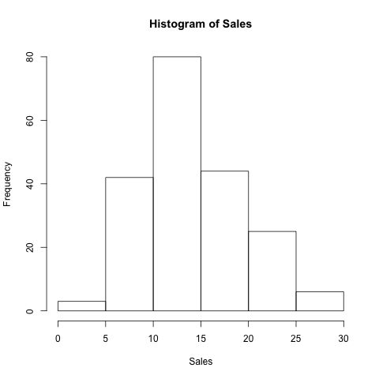

## Abstract
This report reproduces a simple linear regression in the book *An Introduction to Statistical Learning* by Gareth James, Daniela Witten, Trevor Hastie, and Robert Tibshirani. The model uses the explanatary variable, TV advertising budget, to predict sales. For more information, please refer to Chapter 3.1 of the book.

## Introduction
The main goal of the analysis is to provide details about whether advertisements through different channels improve sales, and this report will look at television advertisements. We want to learn whether there is a relationship between TV advertisement budget and sales, and if there is we want to describe the relationship with a model, in this case a simple linear model.

## Data
The data set we are using, **Advertising.csv**, contains 200 data samples, each sample containing the response variable **Sales** and the explanatary variables **TV, Radio, and Newspaper**. [Advertising.csv](http://www-bcf.usc.edu/~gareth/ISL/Advertising.csv) can be downloaded for free, and credit goes to Gareth James, Daniela Witten, Trevor Hastie and Robert Tibshirani. 

Since we are mainly focused on **TV** and **Sales** in this paper, we have two histograms of the data distribution for the two variables.





As you can see from *Figure 1*, the distribution of the TV data is quite uniform. However, the data of the sales data is more normal.

## Methodology
We consider **Sales** and **TV** in our dataset and try to fit them in a simple linear regression model:

$$ Sales = \beta_0 + \beta_1TV $$

And to find the values for the two coefficients $\beta_0$ and $\beta_1$, we fit the linear regression model based on the normal least square criterion. $\beta_0$ represents the intercept term and $\beta_1$ represents the weight of influence that **TV** plays in predicting the sales. Now one might ask how does the estimation of these parameters work? Since we are using the least square method, the parameters are estimated so that the sum of squares of the predicted sales and the actual sales is minimized.

## Results

Since we are trying to find a linear model, it's extremely easy in R to achieve that and get valuable summary feedbacks. Below shows the code to read in the data set and to fit a linear model with TV being the explanatary variable and Sales being the response variable. The tables following that are the summary statistics that the linear model contains:

```
advertising = read.csv("data/Advertising.csv", header = T)
model = lm(Sales ~ TV, data=advertising)
summary(model)
```

Coefficients| Estimate | Std. Error | t values    | p-value
------------|----------|------------|-------------|---------
Intercept   | 7.0325   | 0.4578     | 15.36       | <2.2e-16
TV          | 0.0475   | 0.0027     | 17.67       | <2.2e-16

Summary                | Value
-----------------------|-------
Residual Standard Error| 3.259
R-squared              | 0.612
F-statistic            | 312.1

After we fit the model, we can plot the data points in a scatter plot as well as the fitted linear model to better visualize the relationship between **TV** and **Sales**.

```
plot(Sales~TV, data=advertising, main="Plot of TV and Sales")
abline(model,col='red')
```


## Conclusions

From Figure 3, we can see that the relationship between **TV** and **Sales** is quite linear, and it's also a positively correlated relationship. Since the null hypothesis is that there is no relationship between **TV** and **Sales**, the close to zero p-value of the TV coefficient means that we can reject the null hypothesis. Based on the model, we can conclude that an increase in **TV** advertising budget will lead to increase in **Sales**. To be more precise, an increase in $1000 in **TV** advertising budget will lead to around 47.5 unit increase in **Sales**. 

The linaer model we have here is decent, but improvements can be made by increase the number of data samples as well as adding new features into the model that could provide more insight into whether increase in advertising will indeed increase sales. 
