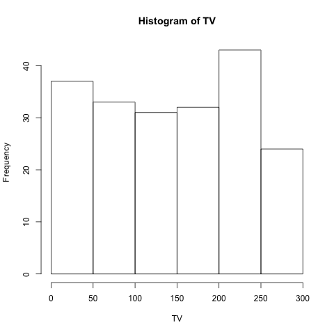

## Abstract
This report reproduces a simple linear regression in the book *An Introduction to Statistical Learning* by Gareth James, Daniela Witten, Trevor Hastie, and Robert Tibshirani. The model uses the explanatary variable, TV advertising budget, to predict sales. For more information, please refer to Chapter 3.1 of the book.

## Introduction
The main goal of the analysis is to provide details about whether advertisements through different channels improve sales, and this report will look at television advertisements. We want to learn whether there is a relationship between TV advertisement budget and sales, and if there is we want to describe the relationship with a model, in this case a simple linear model.

## Data
The data set we are using, **Advertising.csv**, contains 200 data samples, each sample containing the response variable **Sales** and the explanatary variables **TV, Radio, and Newspaper**. [Advertising.csv](http://www-bcf.usc.edu/~gareth/ISL/Advertising.csv) can be downloaded for free, but credit goes to Gareth James, Daniela Witten, Trevor Hastie and Robert Tibshirani. 

## Methodology
We consider _Sales_ and _TV_ in our dataset and try to fit them in a simple linear regression model:

\begin{center}

$Sales = \beta_0 + \beta_1TV$

\end{center}

And to find the values for the two coefficients $\beta_0$ and $\beta_1$, we fit the linear regression model based on the normal least square criterion.

## Results

## Conclusions
